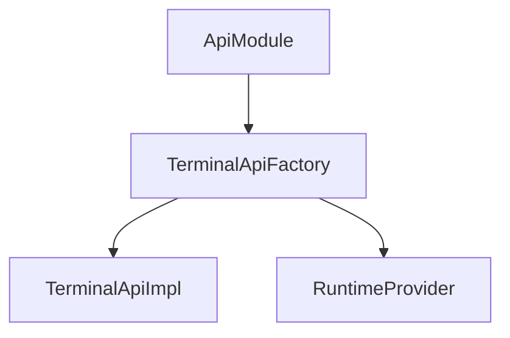
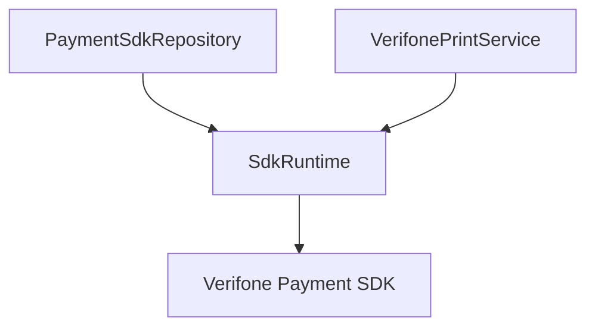
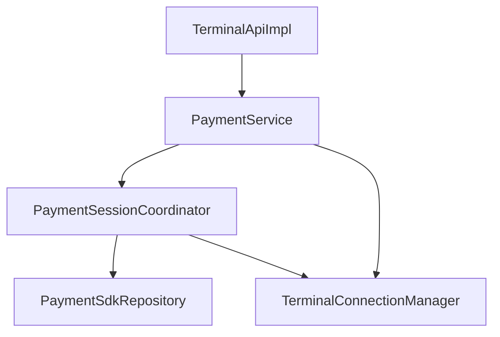
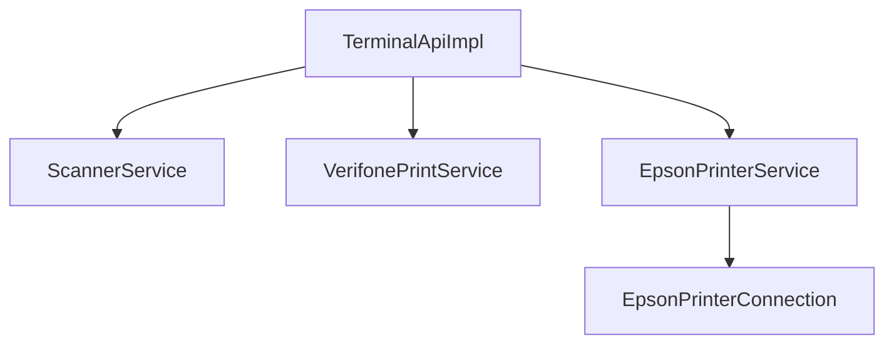
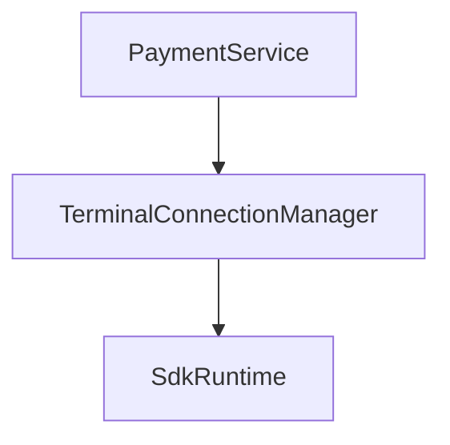
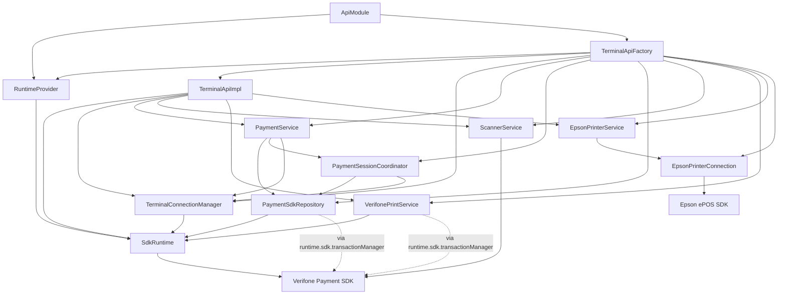

# Architecture

**Target audience:** developers of the integration layer.

This page outlines the module’s internal architecture. For external usage, see [Introduction](../introduction.md).

## Responsibility boundary

The application layer interacts only with `ApiModule` and `TerminalApi`. All code within `com.example.testv660p.internal` is considered internal implementation within the integration layer.

## Overview

The integration layer is structured around a small public API and a set of
internal services responsible for specific domains:

- Connection management
- Payment orchestration
- Printing (Verifone and Epson)
- Scanner

## Composition root

Object creation and wiring are handled in one place.

`TerminalApiFactory` is responsible for constructing and wiring all internal
dependencies.

## Runtime and SDK boundary

All interaction with the Verifone SDK is centralized through `SdkRuntime`.

This ensures:

* a single integration point toward the SDK
* consistent lifecycle handling
* easier testing and isolation

## Payment flow

Payment is coordinated across multiple components.

Responsibilities:

* `PaymentService`
  Entry point for payment operations from the API layer.

* `PaymentSessionCoordinator`
  Coordinates session lifecycle and sequencing.

* `PaymentSdkRepository`
  Performs SDK calls via `SdkRuntime`.

* `TerminalConnectionManager`
  Ensures the terminal is connected and ready.

## Device features

Scanner and printing are handled as separate feature services.

Notes:

* Verifone printing goes through the SDK (`SdkRuntime`)
* Epson printing uses a separate integration and connection

## Connection management

Connection state is centralized.

`TerminalConnectionManager` is responsible for:

* tracking connection state
* reacting to SDK communication changes
* coordinating reconnection when needed

## Design principles

* Single entry point: `TerminalApi`
* Centralized SDK access via `SdkRuntime`
* Separation of concerns per feature (payment, printing, scanner)
* Explicit coordination for complex flows (payment sessions)
* Internal implementation hidden behind the public API

## Full dependency graph (reference)

The full object graph is shown below for completeness.

This diagram is intended for reference and debugging, not as a primary overview.

## Components
Internal classes and their responsibilities.

### ApiModule

Owns the integration instance for the process and selects between `MockTerminalApi` and the physical `TerminalApiImpl`.

It is responsible for initializing and starting the integration. See
[Initialization](lifecycle/initialization.md) for the startup sequence.

### TerminalApiFactory

Constructs the dependency graph for a physical terminal, including:

* runtime
* connection manager
* payment repository and services
* Verifone and Epson print services
* scanner
* `TerminalApiImpl`

### TerminalApiImpl

Implements `TerminalApi` and delegates to domain-specific services.

This class should remain thin. Logic that is close to the PSDK should generally be placed in the runtime, repository, or service layer depending on responsibility.

### SdkRuntime

A wrapper around `PaymentSdk`.

Responsible for:

* creating and owning the `PaymentSdk` instance
* SDK initialization and teardown
* login and logout
* registering SDK listeners
* exposing SDK events as Kotlin Flows
* exposing device information

**Constraint:** the `PaymentSdk` instance is created and owned by `SdkRuntime`. Direct access through `runtime.sdk` should stay limited to low-level adapters.

### TerminalConnectionManager

Owns connection state and reconnection logic.

It must not contain UI logic or payment-specific business logic.
See [Connection and reconnection](lifecycle/connection.md) for details.

### PaymentSdkRepository

The lowest-level payment adapter around the PSDK `TransactionManager`.

It may depend on SDK types and events, but must not expose them in public models.

### PaymentService

A façade on top of the repository for payment workflows.

Responsible for:

* sale, split-payment part, unlinked refund, void, and abort operations
* preventing concurrent payment operations
* invoking `PaymentSessionCoordinator` for session-scoped operations
* converting API input into repository/PSDK-oriented arguments
* gift-card/stored-value setup for split-payment parts
* optional card verification for unlinked refunds
* mapping internal payment results and failures to `PaymentResult` and `PaymentError`
* extracting receipt text for public payment results
* marking the terminal disconnected when payment failures indicate connection loss
* payment-related logging

### PaymentSessionCoordinator

Encapsulates the pattern: start session → perform operation → end session.

Use this when introducing new payment operations that require a PSDK session.

### Printing and scanning

* `VerifonePrintService` uses the PSDK through `SdkRuntime`
* `ScannerService` receives `runtime.sdk` directly
* `EpsonPrinterConnection` owns the Epson ePOS `Printer` connection
* `EpsonPrinterService` formats and sends Epson print commands through that connection

For public usage, see:

* [Receipt printing](../build-pos/features/receipt-printing.md)
* [Scanner](../build-pos/features/scanner.md)

## Lifecycle

Startup, connection, and teardown are described in:

* [Initialization](lifecycle/initialization.md)
* [Connection and reconnection](lifecycle/connection.md)
* [Teardown](lifecycle/teardown.md)